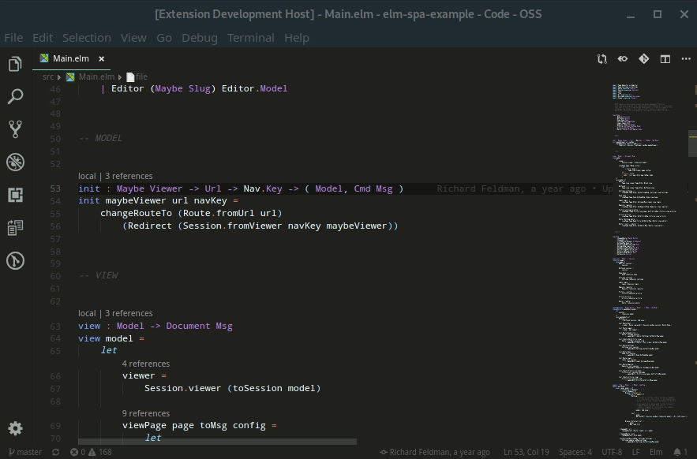

# ElmLS



This [vscode extension](https://marketplace.visualstudio.com/items?itemName=Elmtooling.elm-ls-vscode) is including the [elm-language-server](https://github.com/elm-tooling/elm-language-server) which enables most of the used features.

You will need to install `elm`, `elm-test` and `elm-format`, to get all diagnostics. If your setup fails to find the global installations of those, you can use the settings panel is VSCode to set the paths to the executables manually.

```shell
npm install -g elm elm-test elm-format
```

## Features

Supports elm 0.19

| Feature          | Description                                                                                                                                          |
| ---------------- | ---------------------------------------------------------------------------------------------------------------------------------------------------- |
| Diagnostics      | Provided via `elm make` and `elm-analyse`                                                                                                            |
| Formatting       | Provided via `elm-format` and post-processed to only return a diff of changes. This way it should not be as intrusive as running `elm-format` normal |
| codeLenses       | Currently only shows if a type alias, custom type or function is exposed from that module                                                            |
| completions      | Show completions for the current file and snippets                                                                                                   |
| definitions      | Enables you to jump to the definition of a type alias, module, custom type or function                                                               |
| documentSymbols  | Identifies all symbols in a document.                                                                                                                |
| folding          | Let's you fold the code on certain elm constructs                                                                                                    |
| hover            | Shows type annotations and documentation for a type alias, module, custom type or function                                                           |
| references       | Lists all references to a type alias, module, custom type or function                                                                                |
| rename           | Enables you to rename a type alias, module, custom type or function                                                                                  |
| workspaceSymbols | Identifies all symbols in the current workspace                                                                                                      |

## Extension Settings

This extension contributes the following settings:

- `elmLS.trace.server`: Enable/disable trace logging of client and server communication
- `elmLS.elmPath`: The path to your elm executable.
- `elmLS.elmFormatPath`: The path to your elm-format executable.
- `elmLS.elmTestPath`: The path to your elm-test executable.

## Contributing / Debugging

```shell
git clone --recursive git@github.com:elm-tooling/elm-language-client-vscode.git
cd elm-language-client-vscode
npm install
```

Open VSCode with this project (`code .`) and press `F5` to start debugging the plugin.
